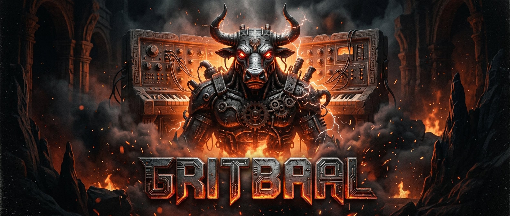

# Gritbaal Synth

**Gritbaal** is an über-gritty, highly characterful vintage analog synthesizer emulation plugin implemented in standard C++ and exported as a `.clap` (CLAP audio plugin) module.

## Overview

Gritbaal is designed to bring deep analog grit, rich harmonic saturation, transistor ladder & diode filter distortion, thermal oscillator drift, and aggressive overdrive to modern plugin hosts. Built with non-linear modeling techniques derived from vintage circuit topologies (Moog ladder, Korg MS-20 diode rings, OTA topologies, and discrete transistor distortion stages), Gritbaal combines raw analog aggression with pleasant musical harmonics.

## Key Features

- **CLAP Plugin Architecture:** Native support for the CLAP plugin format with zero external dependencies (aside from the included `clap` C headers).
- **Dual Anti-Aliased VCOs:** PolyBLEP oscillators with continuous thermal pitch drift, oscillator hard sync, ring modulation, and sub-oscillator options.
- **Gritty Multi-Topology Filter (VCF):** Zero-Delay Feedback (TPT/ZDF) non-linear transistor ladder filter with driven feedback, resonance saturation, and optional MS-20 style diode overdrive.
- **Circuit-Level Non-Linearities & Overdrive:** Modelled saturation curves (`tanh` / asymmetric transistor transfer functions), capacitor memory, thermal noise bleed, and power rail sagging under heavy distortion.
- **Dual Envelopes & Modulation:** Fast analog-style ADSR envelopes with exponential decay/release curves and flexible modulation routing.
- **Built-in GUI & Test Suite:** Custom lightweight GUI framework and standalone C++ test executables for DSP and GUI verification.

## Project Structure

- `src/core/`: Synth engine, oscillators, non-linear ZDF filters, and envelopes.
- `src/clap/`: CLAP plugin interface wrapper (`GritbaalClap`).
- `src/gui/`: Native GUI renderer and window management.
- `docs/`: Design documents and the *Vintage Analog Synthesizer Modeling Compendium*.
- `clap/`: CLAP SDK headers.

## Building

Gritbaal uses CMake (3.15+) and standard C++17.

```bash
mkdir build
cd build
cmake ..
make
```

This generates:
- `gritbaal.clap`: The main CLAP synth plugin module.
- `gritbaal_dsp_test`: Standalone DSP verification executable.
- `gritbaal_gui_test`: Standalone GUI renderer verification executable.

## Documentation

For architectural details, oscillator/filter design choices, and circuit non-linearity modeling plans, see [docs/design_document.md](docs/design_document.md).
For a comprehensive reference on vintage synth modeling techniques, see [docs/vintage_synth_modelleing_compendium.md](docs/vintage_synth_modelleing_compendium.md).

## License

MIT License. See `LICENSE` for details.
